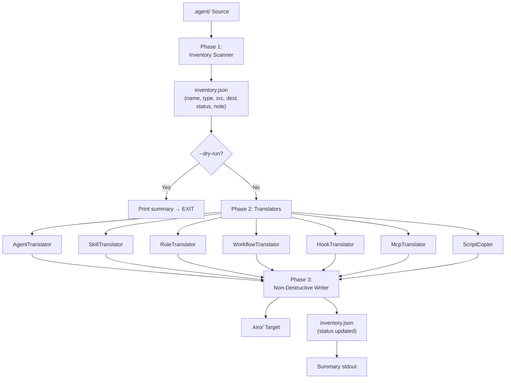

# Design — Antigravity Kit → Kiro Integration

> Spec: `antigravity-kiro-integration`
> Trạng thái: **Draft**

---

## Overview

Tính năng này cung cấp công cụ migration Python (`migrate_antigravity.py`) dịch Antigravity Kit từ định dạng `.agent/` sang định dạng `.kiro/` tương thích Kiro IDE. Quá trình bao gồm ba giai đoạn: **Inventory** (bóc tách), **Translate** (dịch từng loại), **Install** (ghi non-destructive).

Kết quả: Antigravity Kit (~61 agents, ~1845 skills, 13 workflows, 2 rules, hooks, MCP) hoạt động song song với ECC set hiện có trong `.kiro/` — không xung đột, không ghi đè.

---

## Architecture



**Nguyên tắc cốt lõi:**
- **Non-destructive**: Writer chỉ tạo file mới, không ghi đè.
- **Fail-soft**: Lỗi một thành phần không dừng pipeline.
- **Idempotent**: Chạy nhiều lần → cùng kết quả.
- **Cross-platform**: Dùng `pathlib.Path` xuyên suốt.

---

## Components and Interfaces

### `migrate_antigravity.py` — Tool chính

```
migrate_antigravity.py
  ├── CLI entry point (argparse)
  │     --source  PATH   (default: .agent/)
  │     --target  PATH   (default: .kiro/)
  │     --dry-run        (chỉ sinh inventory, không copy)
  │     --verbose        (log chi tiết từng file)
  │
  ├── InventoryScanner      → inventory.json
  ├── AgentTranslator       → .kiro/agents/
  ├── SkillTranslator       → .kiro/skills/
  ├── RuleTranslator        → .kiro/steering/antigravity-*.md
  ├── WorkflowTranslator    → .kiro/steering/workflow-*.md
  ├── HookTranslator        → .kiro/hooks/session-start.kiro.hook
  ├── McpTranslator         → .kiro/settings/mcp-antigravity.json.example
  ├── ScriptCopier          → .kiro/scripts/python/
  └── NonDestructiveWriter  → ghi file, skip nếu đã tồn tại
```

### `inventory.json` — Schema

```json
{
  "meta": {
    "generated_at": "2025-01-01T00:00:00Z",
    "source_root": ".agent/",
    "target_root": ".kiro/",
    "tool_version": "1.0.0"
  },
  "entries": [
    {
      "name": "backend-specialist",
      "type": "agent",
      "source_path": ".agent/agents/backend-specialist.md",
      "dest_path": ".kiro/agents/backend-specialist.md",
      "status": "translated",
      "note": ""
    }
  ],
  "summary": {
    "agents": {"total": 61, "translated": 0, "skipped": 0, "invalid": 0},
    "skills": {"total": 1845, "translated": 0, "skipped": 0, "invalid": 0},
    "steering": {"total": 15, "translated": 0, "skipped": 0},
    "hooks": {"total": 1, "translated": 0, "skipped": 0},
    "errors": 0
  }
}
```

**Giá trị `status` hợp lệ:** `pending` | `translated` | `skipped` | `invalid`

**Giá trị `type` hợp lệ:** `agent` | `skill` | `rule` | `workflow` | `hook` | `mcp` | `script`

---

## Data Models

### Mapping Tables: Antigravity → Kiro

#### Agents (`.agent/agents/*.md` → `.kiro/agents/*.md`)

| Trường Antigravity | Giá trị ví dụ | Kiro IDE yêu cầu | Hành động |
|---|---|---|---|
| `tools: Read, Grep, Bash` | CSV string | JSON array | Split by `,` → `["Read", "Grep", "Bash"]` |
| `model: inherit` | `inherit` | model cụ thể | Map → `claude-sonnet-4-5` |
| `model: <khác>` | `claude-opus` | giữ nguyên | Giữ nguyên |
| `skills: a, b, c` | CSV string | không dùng | Xoá khỏi frontmatter |
| `name:`, `description:` | chuỗi | giữ nguyên | Giữ nguyên |
| Body markdown | nội dung agent | giữ nguyên | Không sửa |

**Template frontmatter kết quả:**
```yaml
---
name: backend-specialist
description: Expert backend architect...
tools: ["Read", "Grep", "Glob", "Bash", "Edit", "Write"]
model: claude-sonnet-4-5
---
```

**Conflict với ECC:** Nếu `.kiro/agents/<name>.md` đã tồn tại → `status: skipped`. Không raise exception.

---

#### Skills (`.agent/skills/<name>/` → `.kiro/skills/<name>/`)

| Thành phần | Hành động |
|---|---|
| `SKILL.md` có frontmatter đầy đủ | Copy nguyên vẹn |
| `SKILL.md` thiếu `name`/`description` | Inject minimal frontmatter từ tên thư mục |
| `scripts/`, `references/`, `assets/` | Copy đệ quy |
| Skill đã tồn tại ở đích | Skip toàn bộ thư mục |

**Batch processing:** 100 skills/batch, in tiến độ `[Batch 3/19] Skills 201-300...` ra stdout.

---

#### Rules → Steering (`.agent/rules/` → `.kiro/steering/`)

| File nguồn | File đích | `inclusion` |
|---|---|---|
| `rules/GEMINI.md` | `steering/antigravity-master-rules.md` | `auto` |
| `rules/CONTEXT-INPUT.md` | `steering/antigravity-context-input.md` | `auto` |

---

#### Workflows → Steering (`.agent/workflows/` → `.kiro/steering/`)

| Workflow | File đích | `inclusion` | Lý do |
|---|---|---|---|
| `orchestrate.md` | `steering/workflow-orchestrate.md` | `auto` | Luôn cần |
| tất cả workflow còn lại | `steering/workflow-<name>.md` | `manual` | Theo yêu cầu |

---

#### Hooks (`.agent/hooks/hooks.json` → `.kiro/hooks/session-start.kiro.hook`)

| Thuộc tính | Nguồn | Đích | Ghi chú |
|---|---|---|---|
| Trigger type | `SessionStart` | `promptSubmit` | Kiro không có SessionStart; promptSubmit là tương đương gần nhất |
| Command | `"${CLAUDE_PLUGIN_ROOT}/..."` | `"python .kiro/scripts/python/session_manager.py"` | Thay biến env |
| Hook type | `runCommand` | `runCommand` | Tương thích |

**Schema `.kiro.hook` kết quả:**
```json
{
  "version": "1.0.0",
  "name": "session-start",
  "description": "Antigravity session start hook (migrated from hooks.json)",
  "enabled": true,
  "when": { "type": "promptSubmit" },
  "then": {
    "type": "runCommand",
    "command": "python .kiro/scripts/python/session_manager.py"
  }
}
```

---

#### MCP (`.agent/mcp_config.json` → `.kiro/settings/mcp-antigravity.json.example`)

| Hành động | Chi tiết |
|---|---|
| Không đụng `mcp.json` / `mcp.json.example` ECC | Tạo file mới `mcp-antigravity.json.example` |
| Sanitize secrets | Field tên chứa `api_key`, `apiKey`, `token`, `secret`, `password`, `key` → placeholder |
| Xoá JS comments | Strip `// ...` trước khi parse JSON |
| Recurse nested dict | `env` object trong MCP config có thể chứa secrets |
| Giữ nguyên | `command`, `args`, `disabled`, `autoApprove` |

---

## Luồng dữ liệu chi tiết (Data Flow)

### Phase 1: Inventory Scanner

```
scan_source(source_root: Path) → List[InventoryEntry]

1. Quét agents/:    glob("*.md")        → type=agent
2. Quét skills/:    glob("*/SKILL.md")  → type=skill (parent dir)
3. Quét rules/:     glob("*.md")        → type=rule
4. Quét workflows/: glob("*.md")        → type=workflow
5. Quét hooks/:     đọc hooks.json      → type=hook
6. Đọc mcp_config.json                  → type=mcp
7. Quét scripts/:   glob("*.py")        → type=script

Với mỗi entry:
  - Tính dest_path từ mapping table
  - dest_path.exists() → status=skipped ngay trong scan
  - Validate required fields → status=invalid nếu thiếu
  - Ghi inventory.json
```

### Phase 2: Translators

```python
AgentTranslator.translate(entry) → str:
  1. Đọc source file
  2. Parse YAML frontmatter
  3. Normalize: tools CSV→list, model inherit→claude-sonnet-4-5, xoá skills
  4. Serialize frontmatter + giữ nguyên body
  5. Trả về content đã normalize

SkillTranslator.translate_batch(entries[i:i+100]):
  1. Copy skill dir
  2. Kiểm tra SKILL.md có frontmatter không
  3. Inject minimal frontmatter nếu thiếu name/description
  4. In tiến độ batch ra stdout

WorkflowTranslator.translate(entry) → str:
  1. Đọc workflow content
  2. Prepend frontmatter:
     name == "orchestrate" → inclusion: auto
     khác                  → inclusion: manual

McpTranslator.translate(path) → dict:
  1. Strip JS comments trước khi parse JSON
  2. Recurse vào nested dict để sanitize secrets
  3. Xuất ra Kiro mcpServers format
```

### Phase 3: Non-Destructive Writer

```python
def write(dest_path: Path, content: str) -> WriteResult:
    if dest_path.exists():
        return WriteResult(status="skipped", note="already exists")
    dest_path.parent.mkdir(parents=True, exist_ok=True)
    dest_path.write_text(content, encoding="utf-8")
    return WriteResult(status="translated")
```

---

## Xử lý Conflicts / Deduplication với ECC

### Nguyên tắc: Additive-only, không destructive

| Tình huống | Hành động |
|---|---|
| Agent / Skill / Steering trùng tên | Skip Antigravity version, giữ ECC |
| Hook file trùng | Skip |
| MCP | Luôn tạo `mcp-antigravity.json.example` (tên riêng) |

### AGENTS.md append (idempotent)

```markdown
<!-- ANTIGRAVITY-AGENTS-START -->
## Antigravity Agents (migrated)
...
<!-- ANTIGRAVITY-AGENTS-END -->
```

Chạy lại: kiểm tra marker đã tồn tại → skip append.

---

## Correctness Properties

`migrate_antigravity.py` là tập hàm biến đổi thuần (pure transformations) — PBT phù hợp. Thư viện: **Hypothesis**.

| # | Property | Validates |
|---|---|---|
| P1 | Non-destructive Write — file đích trước migration không bị đổi nội dung | Req 7.1 |
| P2 | Idempotence — `migrate()` lần 2 = lần 1 | Req 7.2 |
| P3 | Agent frontmatter: `tools`→list, `model`≠`inherit`, no `skills` key, body unchanged | Req 2.1, 2.2 |
| P4 | Fail-soft — N valid→translated/skipped, M invalid→invalid, không propagate exception | Req 7.5, 1.3 |
| P5 | Workflow inclusion routing — `orchestrate`→`auto`, khác→`manual` | Req 4.1 |
| P6 | Skill frontmatter injection — kết quả có `name` + `description` không rỗng | Req 3.3 |
| P7 | MCP sanitization — secret fields→placeholder, non-secret fields giữ nguyên | Req 6.2 |

```python
# P3 ví dụ
@given(
    tools_csv=st.text(),
    model=st.sampled_from(["inherit", "claude-opus"]),
    body=st.text()
)
def test_normalize_frontmatter(tools_csv, model, body):
    result = normalize_frontmatter(tools=tools_csv, model=model, body=body)
    assert isinstance(result["tools"], list)
    assert result["model"] != "inherit"
    assert "skills" not in result["frontmatter"]
    assert result["body"] == body
```

---

## Error Handling

```python
for entry in pending_entries:
    try:
        content = translator.translate(entry)
        writer.write(entry.dest_path, content)
        entry.status = "translated"
    except Exception as e:
        entry.status = "invalid"
        entry.note = f"{type(e).__name__}: {e}"
        # không re-raise — tiếp tục entry tiếp theo
```

| Lỗi | Xử lý |
|---|---|
| `InvalidFrontmatterError` | `status=invalid` |
| `YAMLParseError` | `status=invalid` |
| `PermissionError` | `status=invalid`, tiếp tục |
| `JSONDecodeError` | `status=invalid` cho component đó |
| `UnicodeDecodeError` | Thử latin-1 fallback, rồi `status=invalid` |
| Trigger mismatch (`SessionStart`) | Map → `promptSubmit`, ghi note, không raise |

---

## Testing Strategy

### Cấu trúc test

```
tests/
├── unit/
│   ├── test_agent_translator.py    # 4 tests
│   ├── test_skill_translator.py    # 2 tests
│   ├── test_workflow_translator.py # 2 tests
│   ├── test_hook_translator.py     # 1 test
│   ├── test_mcp_translator.py      # 3 tests
│   └── test_writer.py              # 3 tests
├── property/
│   ├── test_properties.py          # 7 property tests (Hypothesis, min 100 iter)
│   └── strategies.py               # custom strategies
└── integration/
    └── test_full_migration.py      # end-to-end với tmp_path
```

**Coverage target:** ≥ 80%. CI: `pytest tests/ --hypothesis-seed=0`.
