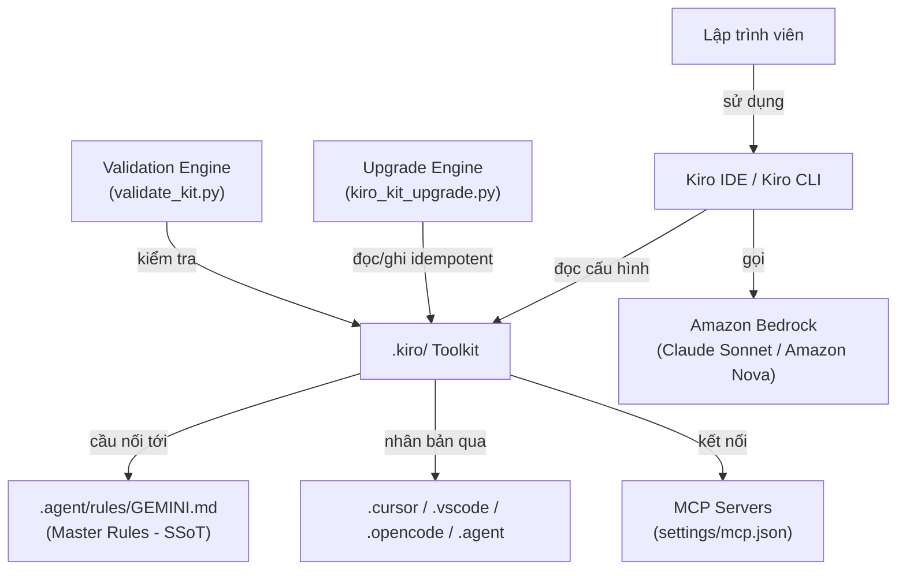
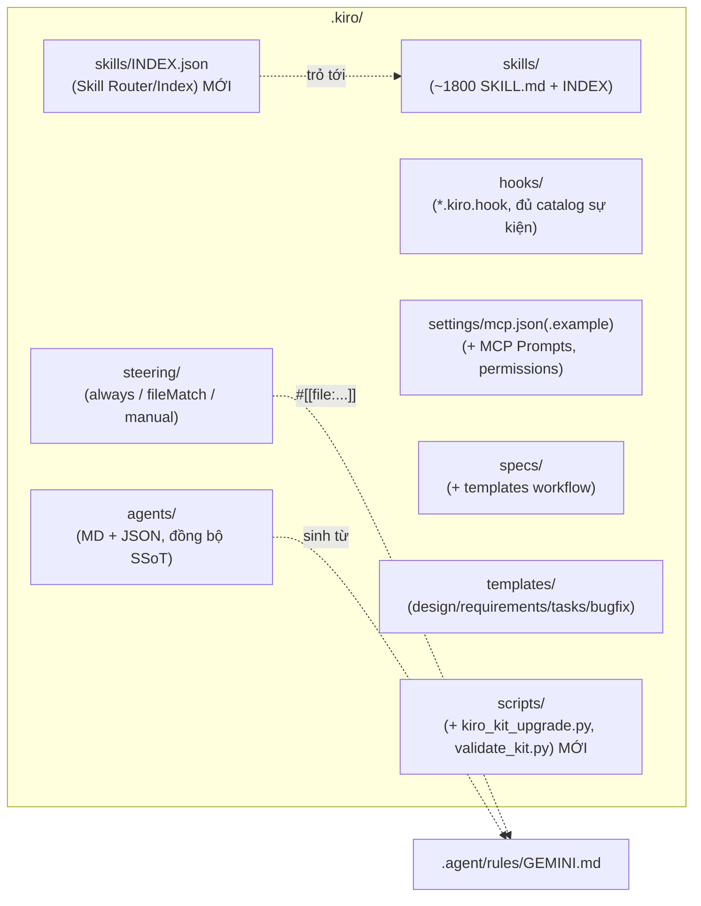
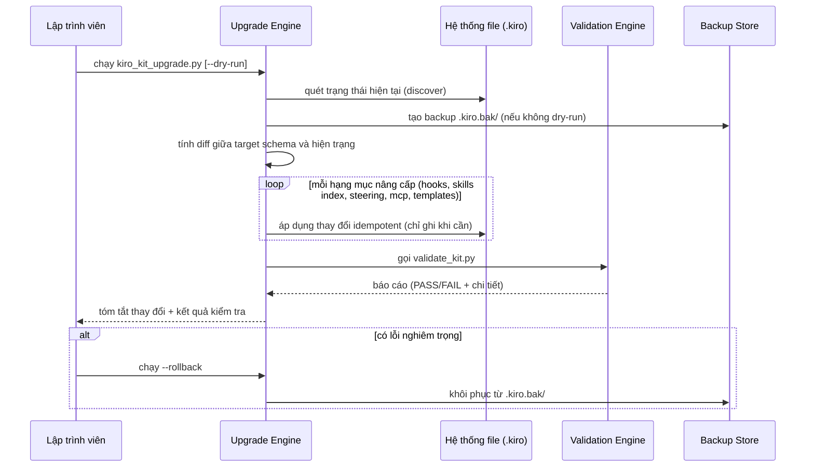
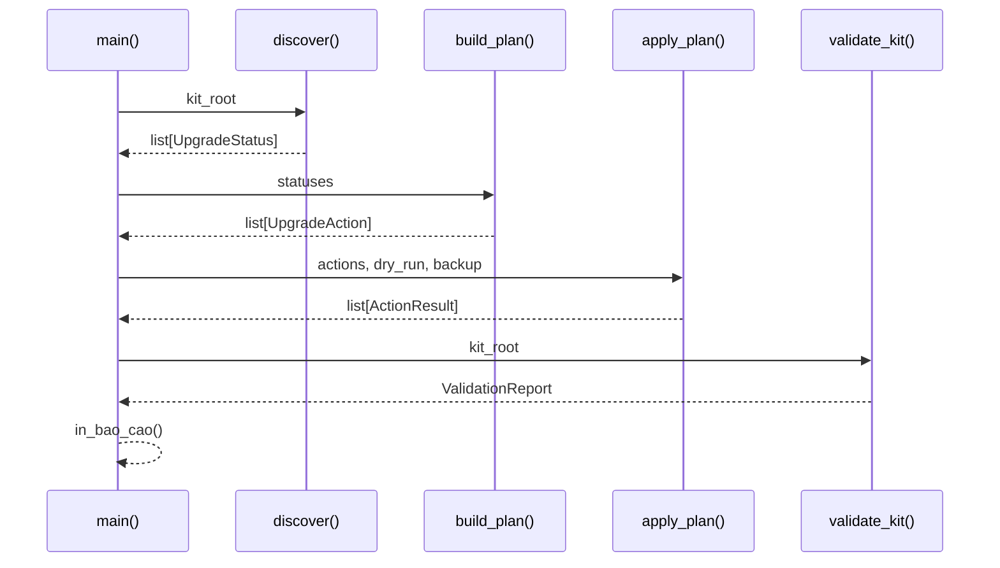

# Tài liệu Thiết kế: Nâng cấp Bộ Kit Kiro (`kiro-kit-upgrade`)

> Ngôn ngữ trình bày: Tiếng Việt (theo `AGENTS.md`).
> Ngôn ngữ cho mã nguồn Low-Level Design: **Python 3.11+** (ngôn ngữ công cụ hiện hữu của kit — `migrate_antigravity.py`, `.kiro/scripts/`). Schema dùng JSON, front-matter dùng YAML.
> Nguồn chân lý (Single Source of Truth) của toàn bộ logic agent: `.agent/rules/GEMINI.md`. Các file steering của Kiro chỉ là cầu nối (bridge) tới nguồn này.

---

## Overview

### (1. Tổng quan)

Tính năng này nâng cấp bộ kit `.kiro` hiện có để đồng bộ với các năng lực mới nhất của Kiro IDE/CLI (bản quốc tế 07/05/2026, chạy trên Amazon Bedrock, định tuyến giữa Claude Sonnet và Amazon Nova). Triết lý cốt lõi của Kiro là _spec là nguồn chân lý, code là sản phẩm dựng (build artifact)_, với luồng spec: Requirements (EARS) → Design → Tasks.

Bộ kit `.kiro` hiện tại được sinh ra từ "Everything Claude Code for Kiro" và là một thành phần trong "Unified AI Agent Toolkit" — bộ cấu hình thống nhất được nhân bản (mirror) qua nhiều IDE (`.agent`, `.cursor`, `.vscode`, `.kiro`, `.opencode`). Bản nâng cấp phải: (a) cập nhật hooks theo đúng danh mục sự kiện hiện hành, (b) bổ sung cơ chế chỉ mục/định tuyến cho thư viện ~1800 skill để nạp ngữ cảnh theo nhu cầu, (c) tối ưu steering theo các chế độ inclusion, (d) nâng cấp cấu hình MCP, (e) bổ sung biến thể spec workflow (Quick Plan, tác vụ song song, requirements analysis, design-first, bugfix), và (f) cung cấp tiến trình migrate/validate an toàn, idempotent.

Nguyên tắc thiết kế chủ đạo: **không phá vỡ tương thích ngược**, **idempotent** (chạy lại nhiều lần không làm hỏng file), và **tôn trọng mô hình một-nguồn-chân-lý** (Master Rules `.agent/rules/GEMINI.md`).

---

# PHẦN A — THIẾT KẾ TỔNG THỂ (HIGH-LEVEL DESIGN)

## Architecture

### (2. Kiến trúc)

### 2.1. Bối cảnh hệ thống (System Context)



### 2.2. Kiến trúc thành phần của bộ kit sau nâng cấp



### 2.3. Luồng nâng cấp (Upgrade Flow)



### 2.4. Cách các IDE đồng bộ (IDE Sync Model)

Mô hình "một nguồn — nhiều bản chiếu". `.agent/rules/GEMINI.md` là nguồn chân lý cho logic agent. Các thư mục IDE (`.kiro`, `.cursor`, `.vscode`, `.opencode`) chứa các file cầu nối/bản chiếu trỏ về nguồn này qua tham chiếu `#[[file:...]]` (Kiro) hoặc đường dẫn tương đối. Upgrade Engine không sao chép logic trùng lặp; nó chỉ đảm bảo các file cầu nối tồn tại, hợp lệ và trỏ đúng nguồn.

---

## Components and Interfaces

### (3. Thành phần và Giao diện)

### Thành phần 1: Upgrade Engine (`scripts/kiro_kit_upgrade.py`)

**Mục đích**: Điều phối nâng cấp toàn bộ kit một cách idempotent, có backup và dry-run.
**Trách nhiệm**:

- Phát hiện hiện trạng kit (phiên bản, thành phần thiếu/lỗi thời).
- Áp dụng từng "upgrader" con (hooks, skill index, steering, mcp, templates).
- Tạo backup trước khi ghi, hỗ trợ rollback.
- Gọi Validation Engine và tổng hợp báo cáo.

### Thành phần 2: Validation Engine (`scripts/validate_kit.py`)

**Mục đích**: Kiểm tra tính hợp lệ của toàn bộ kit sau (hoặc độc lập với) nâng cấp.
**Trách nhiệm**:

- Validate mọi `.kiro.hook` theo JSON schema hiện hành.
- Kiểm tra `skills/INDEX.json` đầy đủ và nhất quán với thư mục `skills/`.
- Kiểm tra front-matter steering hợp lệ (inclusion/fileMatchPattern).
- Kiểm tra `settings/mcp.json` hợp lệ về schema.

### Thành phần 3: Skill Router/Index (`skills/INDEX.json` + bộ sinh)

**Mục đích**: Cho phép khám phá và nạp đúng skill theo nhu cầu trong ~1800 skill mà không phình ngữ cảnh.
**Trách nhiệm**: Lưu metadata gọn (name, description, keywords, path) cho từng skill; phục vụ tra cứu nhanh; được sinh tự động từ front-matter của từng `SKILL.md`.

### Thành phần 4: Hook Catalog Upgrader

**Mục đích**: Bổ sung/đồng bộ hooks theo đủ danh mục sự kiện hiện hành (đặc biệt `preToolUse`/`postToolUse` cho kiểm soát truy cập, `preTaskExecution`/`postTaskExecution` cho tự động hoá spec task).

### Thành phần 5: Steering Optimizer

**Mục đích**: Chuẩn hoá front-matter, gắn chế độ inclusion phù hợp, dùng `#[[file:...]]` để giảm ngữ cảnh always-on và giữ nhất quán với Master Rules bridge.

### Thành phần 6: MCP Config Upgrader

**Mục đích**: Nâng cấp `settings/mcp.json(.example)` để hỗ trợ MCP Prompts và phân quyền tool chi tiết.

### Thành phần 7: Spec Workflow Templates

**Mục đích**: Cung cấp template dưới `templates/` cho design-first, bugfix, và metadata hỗ trợ Quick Plan / tác vụ song song / requirements analysis.

### Giao diện chung (Python — Protocol cho mỗi Upgrader)

```python
from typing import Protocol

class Upgrader(Protocol):
    name: str

    def detect(self, kit_root: str) -> "UpgradeStatus":
        """Phát hiện hiện trạng; KHÔNG ghi file (read-only)."""
        ...

    def plan(self, kit_root: str) -> list["UpgradeAction"]:
        """Tính danh sách hành động cần làm để đạt target; KHÔNG ghi file."""
        ...

    def apply(self, action: "UpgradeAction", dry_run: bool) -> "ActionResult":
        """Áp dụng một hành động idempotent. dry_run=True chỉ mô phỏng."""
        ...
```

---

## Data Models

### (4. Mô hình Dữ liệu)

### 4.1. UpgradeStatus / UpgradeAction / ActionResult

```python
from dataclasses import dataclass, field
from enum import Enum

class Severity(Enum):
    OK = "ok"
    OUTDATED = "outdated"   # tồn tại nhưng lỗi thời
    MISSING = "missing"     # chưa tồn tại
    INVALID = "invalid"     # tồn tại nhưng sai schema

@dataclass(frozen=True)
class UpgradeStatus:
    component: str          # "hooks" | "skill_index" | "steering" | "mcp" | "templates"
    severity: Severity
    details: str

class ActionKind(Enum):
    CREATE = "create"
    UPDATE = "update"
    SKIP = "skip"           # idempotent: đã đạt target

@dataclass(frozen=True)
class UpgradeAction:
    component: str
    kind: ActionKind
    target_path: str
    reason: str

@dataclass(frozen=True)
class ActionResult:
    action: UpgradeAction
    succeeded: bool
    changed: bool           # False nếu idempotent no-op
    message: str
```

**Quy tắc kiểm tra (validation rules)**:

- `target_path` luôn nằm trong `kit_root` (chống path traversal).
- `kind == SKIP` ⇒ `changed == False`.
- Mọi `apply` với `dry_run=True` ⇒ `changed == False` và không có thao tác ghi đĩa.

### 4.2. Lược đồ Skill Index (`skills/INDEX.json`)

```python
@dataclass(frozen=True)
class SkillIndexEntry:
    name: str               # khớp tên thư mục skill
    description: str        # lấy từ front-matter SKILL.md
    keywords: list[str] = field(default_factory=list)
    path: str = ""          # đường dẫn tương đối tới SKILL.md
    category: str | None = None

@dataclass(frozen=True)
class SkillIndex:
    version: str
    generated_at: str       # ISO-8601
    count: int              # PHẢI bằng len(entries)
    entries: list[SkillIndexEntry]
```

**Quy tắc**: `count == len(entries)`; mọi `path` tồn tại trên đĩa; `name` là duy nhất.

---

## Correctness Properties

### (5. Thuộc tính Đúng đắn)

Các thuộc tính sau sẽ được kiểm chứng bằng property-based testing (thư viện đề xuất: **Hypothesis**) ở giai đoạn triển khai:

### Property 1: Hook schema hợp lệ

Với mọi file `*.kiro.hook` trong `hooks/`, nội dung là JSON hợp lệ và thoả JSON schema (đủ trường `version, enabled, name, description, when, then`; `when.type` thuộc danh mục sự kiện hợp lệ).

### Property 2: Migrate idempotent

Với mọi trạng thái kit `S`, chạy `apply(plan(S))` rồi `plan(S')` lần hai cho ra tập hành động chỉ gồm `SKIP` (không thay đổi đĩa).

### Property 3: Skill index đầy đủ

Với mọi thư mục skill có `SKILL.md`, tồn tại đúng một entry trong `INDEX.json`; và `count == len(entries)`.

### Property 4: An toàn đường dẫn

Với mọi `UpgradeAction`, `target_path` nằm trong `kit_root` (không thoát ra ngoài).

### Property 5: Bảo toàn dữ liệu người dùng

Nâng cấp không bao giờ xoá file người dùng tự tạo không thuộc danh mục target; chỉ tạo mới hoặc cập nhật file thuộc kit.

### Property 6: Round-trip backup/rollback

Sau `--rollback`, cây thư mục `.kiro` khớp byte-for-byte với backup đã tạo.

### Property 7: Steering front-matter hợp lệ

Với mọi file steering, `inclusion` thuộc {always, fileMatch, manual}; nếu `fileMatch` thì `fileMatchPattern` không rỗng.

---

## Error Handling

### (6. Xử lý Lỗi)

### Tình huống 1: File `.kiro.hook` sai schema

**Điều kiện**: Validation phát hiện JSON lỗi hoặc thiếu trường bắt buộc.
**Phản hồi**: Ghi vào báo cáo dạng `INVALID`, không tự sửa nội dung ngữ nghĩa; với hành động nâng cấp chỉ tạo file mới nếu thiếu.
**Khôi phục**: Đề xuất hành động sửa cho người dùng; nếu file do upgrade tạo lỗi, rollback từ backup.

### Tình huống 2: Lỗi ghi đĩa giữa chừng

**Điều kiện**: Ngoại lệ I/O khi đang `apply`.
**Phản hồi**: Dừng tiến trình, giữ backup nguyên vẹn.
**Khôi phục**: Gợi ý `--rollback` để trở về trạng thái trước nâng cấp.

### Tình huống 3: Skill thiếu front-matter

**Điều kiện**: `SKILL.md` không có `name`/`description`.
**Phản hồi**: Bộ sinh index ghi cảnh báo, dùng tên thư mục làm `name`, `description` rỗng được đánh dấu cần bổ sung.
**Khôi phục**: Liệt kê trong báo cáo để người dùng bổ sung sau (không chặn toàn bộ tiến trình).

---

## Testing Strategy

### (7. Chiến lược Kiểm thử)

### Unit Testing

- Kiểm thử từng Upgrader: `detect`, `plan`, `apply` (gồm nhánh `dry_run`).
- Validator: hook schema, index completeness, steering front-matter, mcp schema.
- Mục tiêu coverage ≥ 80% (theo `steering/testing.md`).

### Property-Based Testing

- Thư viện: **Hypothesis**.
- Sinh ngẫu nhiên trạng thái kit (tập file hook/steering/skill) để kiểm chứng P1–P7, đặc biệt P2 (idempotency) và P6 (round-trip backup/rollback).

### Integration Testing

- Chạy `kiro_kit_upgrade.py --dry-run` rồi chạy thật trên một bản sao kit tạm; xác nhận lần chạy thứ hai là no-op (toàn `SKIP`).
- E2E (Playwright) không bắt buộc cho phần script; áp dụng cho UI nếu có.

---

## 8. Cân nhắc Bảo mật (Security Considerations)

- **Chống path traversal**: mọi đường dẫn ghi phải được chuẩn hoá và kiểm tra nằm trong `kit_root` (P4).
- **Không lộ secret**: `settings/mcp.json` thật có thể chứa khoá; chỉ thao tác trên `.example`, không in giá trị secret ra log; tham chiếu theo tên khoá.
- **Phân quyền tool MCP**: nâng cấp bổ sung `autoApprove` tối thiểu cần thiết và khuyến nghị quyền `web_fetch` chi tiết theo nguyên tắc đặc quyền tối thiểu.
- **Hook kiểm soát truy cập**: bổ sung hook `preToolUse` để chặn/duyệt các thao tác ghi nhạy cảm trước khi thực thi.

## 9. Phụ thuộc (Dependencies)

- Python 3.11+ (chuẩn thư viện: `json`, `pathlib`, `dataclasses`, `shutil`).
- `PyYAML` để đọc/validate front-matter steering.
- `jsonschema` để validate `.kiro.hook` và `mcp.json`.
- `hypothesis` + `pytest` cho kiểm thử.

---

# PHẦN B — THIẾT KẾ CHI TIẾT (LOW-LEVEL DESIGN)

## 10. Quy trình / Thuật toán chính (Main Workflow)



## 11. Định dạng file & Schema cụ thể (Concrete Schemas)

### 11.1. JSON Schema cho `*.kiro.hook`

```json
{
  "$schema": "http://json-schema.org/draft-07/schema#",
  "title": "KiroHook",
  "type": "object",
  "required": ["version", "enabled", "name", "description", "when", "then"],
  "additionalProperties": false,
  "properties": {
    "version": { "type": "string", "pattern": "^\\d+\\.\\d+\\.\\d+$" },
    "enabled": { "type": "boolean" },
    "name": { "type": "string", "pattern": "^[a-z0-9-]+$" },
    "description": { "type": "string", "minLength": 1 },
    "when": {
      "type": "object",
      "required": ["type"],
      "properties": {
        "type": {
          "enum": ["fileEdited", "fileCreated", "fileDeleted", "userTriggered", "promptSubmit", "agentStop", "preToolUse", "postToolUse", "preTaskExecution", "postTaskExecution"]
        },
        "patterns": { "type": "array", "items": { "type": "string" } },
        "toolTypes": { "type": "array", "items": { "type": "string" } }
      },
      "allOf": [
        {
          "if": { "properties": { "type": { "enum": ["fileEdited", "fileCreated", "fileDeleted"] } } },
          "then": { "required": ["patterns"] }
        },
        {
          "if": { "properties": { "type": { "enum": ["preToolUse", "postToolUse"] } } },
          "then": { "required": ["toolTypes"] }
        }
      ]
    },
    "then": {
      "type": "object",
      "required": ["type"],
      "properties": {
        "type": { "enum": ["runCommand", "askAgent"] },
        "command": { "type": "string" },
        "prompt": { "type": "string" },
        "timeout": { "type": "number", "minimum": 0 }
      }
    }
  }
}
```

### 11.2. Hook mới `preToolUse` (kiểm soát truy cập) — ví dụ `access-control.kiro.hook`

```json
{
  "version": "1.0.0",
  "enabled": true,
  "name": "access-control",
  "description": "Duyet thao tac ghi nhay cam (secret/.env/infra) truoc khi thuc thi.",
  "when": { "type": "preToolUse", "toolTypes": ["fs_write", "executePwsh"] },
  "then": {
    "type": "askAgent",
    "prompt": "Kiem tra thao tac sap thuc hien. Neu ghi vao .env, khoa bi mat, hoac file ha tang, hay yeu cau xac nhan truoc khi tiep tuc."
  }
}
```

### 11.3. Hook mới `postTaskExecution` (tự động hoá spec task) — ví dụ `task-verify.kiro.hook`

```json
{
  "version": "1.0.0",
  "enabled": true,
  "name": "task-verify",
  "description": "Sau khi hoan tat mot spec task, chay quality gate de xac minh.",
  "when": { "type": "postTaskExecution" },
  "then": { "type": "runCommand", "command": "bash .kiro/scripts/quality-gate.sh", "timeout": 300 }
}
```

### 11.4. Front-matter steering chuẩn (YAML)

```yaml
---
inclusion: fileMatch # always | fileMatch | manual
description: Mo ta ngan noi dung steering
fileMatchPattern: '*.cs' # bat buoc neu inclusion = fileMatch
---
# Noi dung — nen tro ve nguon chan ly:
# Master Rules: #[[file:../../.agent/rules/GEMINI.md]]
```

### 11.5. Cấu trúc `settings/mcp.json` sau nâng cấp (MCP Prompts + permissions)

```json
{
  "mcpServers": {
    "bedrock-agentcore-mcp-server": {
      "command": "uvx",
      "args": ["awslabs.amazon-bedrock-agentcore-mcp-server@latest"],
      "env": { "FASTMCP_LOG_LEVEL": "ERROR" },
      "disabled": false,
      "autoApprove": ["search_agentcore_docs", "fetch_agentcore_doc"],
      "prompts": { "enabled": true }
    }
  },
  "toolPermissions": {
    "web_fetch": { "allowedDomains": ["kiro.dev", "docs.aws.amazon.com"] }
  }
}
```

## 12. Đặc tả hàm chính kèm Pre/Post-conditions

### Hàm 1: `is_within_root()`

```python
from pathlib import Path

def is_within_root(kit_root: str, target_path: str) -> bool:
    root = Path(kit_root).resolve()
    target = Path(target_path).resolve()
    return root == target or root in target.parents
```

**Preconditions**: `kit_root`, `target_path` là chuỗi đường dẫn hợp lệ.
**Postconditions**: trả `True` khi và chỉ khi `target_path` nằm trong cây `kit_root` (đảm bảo P4). Không có side effect.

### Hàm 2: `apply_action()`

```python
import json, shutil
from pathlib import Path

def apply_action(kit_root: str, action: UpgradeAction, dry_run: bool) -> ActionResult:
    # Bao ve duong dan (P4)
    assert is_within_root(kit_root, action.target_path), "Duong dan thoat khoi kit_root"

    target = Path(action.target_path)
    desired = render_target_content(action)          # noi dung ky vong cho file dich
    current = target.read_text(encoding="utf-8") if target.exists() else None

    # Idempotent: neu noi dung da khop -> SKIP, khong ghi (P2)
    if current is not None and current == desired:
        return ActionResult(action, succeeded=True, changed=False, message="da dat target (skip)")

    if dry_run:
        return ActionResult(action, succeeded=True, changed=False, message="dry-run: se thay doi")

    target.parent.mkdir(parents=True, exist_ok=True)
    target.write_text(desired, encoding="utf-8")
    return ActionResult(action, succeeded=True, changed=True, message="da ghi")
```

**Preconditions**: `action.target_path` nằm trong `kit_root`; `render_target_content` thuần (deterministic).
**Postconditions**:

- Nếu nội dung hiện tại đã khớp target thì `changed == False` (P2).
- Nếu `dry_run == True` thì không ghi đĩa và `changed == False`.
- Ngược lại file đích chứa đúng `desired`.
  **Loop invariants**: N/A (không vòng lặp).

### Hàm 3: `build_skill_index()`

```python
import json
from pathlib import Path
from datetime import datetime, timezone

def build_skill_index(skills_dir: str) -> dict:
    entries = []
    for skill_md in sorted(Path(skills_dir).glob("*/SKILL.md")):
        fm = parse_front_matter(skill_md)            # doc YAML front-matter
        # Bat bien: moi vong lap them dung 1 entry cho 1 SKILL.md hop le (P3)
        entries.append({
            "name": fm.get("name", skill_md.parent.name),
            "description": fm.get("description", ""),
            "keywords": fm.get("keywords", []),
            "path": str(skill_md.relative_to(Path(skills_dir).parent)),
        })
    return {
        "version": "1.0.0",
        "generated_at": datetime.now(timezone.utc).isoformat(),
        "count": len(entries),                        # P3: count == len(entries)
        "entries": entries,
    }
```

**Preconditions**: `skills_dir` tồn tại.
**Postconditions**: `result["count"] == len(result["entries"])` (P3); mỗi thư mục skill có `SKILL.md` xuất hiện đúng một lần.
**Loop invariants**: sau mỗi vòng, `len(entries)` bằng số `SKILL.md` đã xử lý; mọi `name` đã thêm là duy nhất theo tên thư mục.

### Hàm 4: `validate_hook_file()`

```python
import json
from pathlib import Path
from jsonschema import validate, ValidationError

def validate_hook_file(path: str, schema: dict) -> tuple[bool, str]:
    try:
        data = json.loads(Path(path).read_text(encoding="utf-8"))
    except json.JSONDecodeError as e:
        return (False, f"JSON khong hop le: {e}")
    try:
        validate(instance=data, schema=schema)        # P1
        return (True, "hop le")
    except ValidationError as e:
        return (False, f"Sai schema: {e.message}")
```

**Preconditions**: `schema` là JSON schema hợp lệ (mục 11.1).
**Postconditions**: trả `(True, ...)` khi và chỉ khi file thoả P1. Không side effect lên file đích.

## 13. Ví dụ sử dụng (Example Usage)

```bash
# Xem truoc thay doi, khong ghi dia
python .kiro/scripts/kiro_kit_upgrade.py --kit-root .kiro --dry-run

# Thuc thi nang cap (tao backup .kiro.bak/ truoc khi ghi)
python .kiro/scripts/kiro_kit_upgrade.py --kit-root .kiro

# Chi kiem tra tinh hop le cua kit
python .kiro/scripts/validate_kit.py --kit-root .kiro

# Khoi phuc neu co su co
python .kiro/scripts/kiro_kit_upgrade.py --kit-root .kiro --rollback
```

```python
# Sinh lai chi muc skill doc lap
index = build_skill_index(".kiro/skills")
assert index["count"] == len(index["entries"])      # P3
Path(".kiro/skills/INDEX.json").write_text(
    json.dumps(index, ensure_ascii=False, indent=2), encoding="utf-8"
)
```

## 14. Bản đồ thay đổi cụ thể trên `.kiro` (Change Map)

| Hạng mục    | Hành động                                                | Đường dẫn                                                       |
| ----------- | -------------------------------------------------------- | --------------------------------------------------------------- |
| Skill Index | Thêm mới + bộ sinh                                       | `.kiro/skills/INDEX.json`, `.kiro/scripts/build_skill_index.py` |
| Hooks       | Thêm `preToolUse`/`postTaskExecution`/`preTaskExecution` | `.kiro/hooks/access-control.kiro.hook`, `task-verify.kiro.hook` |
| Hooks       | Validate toàn bộ theo schema                             | `.kiro/hooks/*.kiro.hook`                                       |
| Steering    | Chuẩn hoá front-matter + `#[[file:...]]`                 | `.kiro/steering/*.md`                                           |
| MCP         | Bổ sung MCP Prompts + toolPermissions                    | `.kiro/settings/mcp.json.example`                               |
| Templates   | Thêm design-first + bugfix                               | `.kiro/templates/{design,requirements,tasks,bugfix}/`           |
| Engine      | Thêm script nâng cấp/validate                            | `.kiro/scripts/kiro_kit_upgrade.py`, `validate_kit.py`          |

## 15. Tổng hợp Thuộc tính Đúng đắn để kiểm thử (PBT — Hypothesis)

| ID  | Thuộc tính                                  | Hàm liên quan                    |
| --- | ------------------------------------------- | -------------------------------- |
| P1  | Mọi hook thoả JSON schema                   | `validate_hook_file`             |
| P2  | `apply` idempotent (no-op lần hai)          | `apply_action`                   |
| P3  | Skill index đầy đủ, `count == len(entries)` | `build_skill_index`              |
| P4  | Đường dẫn ghi luôn trong `kit_root`         | `is_within_root`, `apply_action` |
| P5  | Không xoá file người dùng ngoài danh mục    | `build_plan`                     |
| P6  | Round-trip backup/rollback khớp byte        | backup/rollback                  |
| P7  | Front-matter steering hợp lệ                | validator steering               |
