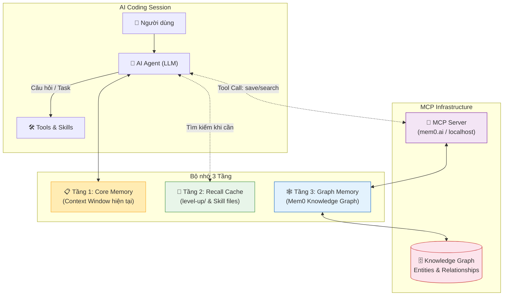

# 📋 PLAN_UPDATE — Kế hoạch nâng cấp Unified AI Toolkit

> Lộ trình phát triển, ưu tiên theo phiên bản.
> Cập nhật: 2026-04-16 | Tác giả: Xuan Thai & Antigravity AI

---

## 🏷️ Phiên bản hiện tại: v2.3 (Graph Memory)

### ✅ Đã hoàn thành (v2.2 & v2.3)

| Phase | Nội dung | Trạng thái |
|-------|----------|:---:|
| Hermes Integration | Tích hợp 117+ skills từ Hermes Agent | ✅ |
| Self-Learning | Giao thức tự học tự động hoàn thiện kỹ năng | ✅ |
| **Level-Up Archive** | **Mirror lưu trữ tiến hóa AI vào `level-up/`** | ✅ |
| VS Code Agents | 16 Custom Agents chuyên biệt | ✅ |
| Graph Memory | **Tích hợp Mem0 (Cloud/Local) qua MCP** | ✅ |
| Mirror-Sync | **Cơ chế Mirror-Directory v1.2.1 hoàn hảo** | ✅ |
| Parallel Agents | **Nâng cấp orchestrator điều phối đa agent** | ✅ |
| Git Tag v2.3 | Đóng gói phiên bản và push lên GitHub | ✅ |

---

## 🚀 Phiên bản v2.3 — "Graph Memory" (2-4 tuần)

### 🎯 Mục tiêu chính: Tích hợp Bộ nhớ Đồ thị Ngoài (External Graph Memory)

> **Vấn đề cốt lõi cần giải quyết:**
> Các AI Agent hiện tại "mất trí nhớ" sau mỗi phiên làm việc vì không có cơ chế
> lưu trữ bền vững các kiến thức, mối quan hệ và quyết định kiến trúc đã đưa ra.
> v2.3 sẽ giải quyết điều này bằng một **Knowledge Graph** ngoài được kết nối qua **MCP**.

---

### 📐 Kiến trúc v2.3: Three-Tier Memory Architecture

```
┌─────────────────────────────────────────────────────────────┐
│                     AI Agent (LLM)                          │
│  ┌─────────────┐   ┌──────────────┐   ┌──────────────────┐ │
│  │  TIER 1     │   │   TIER 2     │   │     TIER 3       │ │
│  │ Core Memory │   │ Recall Cache │   │  Graph Memory    │ │
│  │ (Prompt)    │   │ (level-up/)  │   │  (External MCP)  │ │
│  │             │   │              │   │                  │ │
│  │ • Active    │   │ • Session    │   │ • Entities       │ │
│  │   context   │   │   history    │   │ • Relationships  │ │
│  │ • Current   │   │ • Skill logs │   │ • Project ADRs   │ │
│  │   task      │   │ • Level-Up   │   │ • User prefs     │ │
│  └─────────────┘   └──────────────┘   └────────┬─────────┘ │
└──────────────────────────────────────────────── │ ──────────┘
                                                  │ MCP Protocol
                                    ┌─────────────▼─────────────┐
                                    │    Memory MCP Server       │
                                    │  (Mem0 / Neo4j / Custom)  │
                                    └─────────────┬─────────────┘
                                                  │
                          ┌───────────────────────▼────────────────────┐
                          │           Knowledge Graph Store             │
                          │                                             │
                          │  (Project)──HAS──►(Decision)               │
                          │      │                 │                    │
                          │      └──►(Entity)◄─────►(Skill)            │
                          │              │                              │
                          │              └───►(User Preference)        │
                          └─────────────────────────────────────────────┘
```

---

### 🔬 Nghiên cứu & Lựa chọn Giải pháp

Sau khi phân tích các giải pháp hàng đầu năm 2025–2026:

| Giải pháp | Loại | MCP Ready | Self-hosted | Cloud | Phù hợp |
|-----------|------|:---------:|:-----------:|:-----:|:-------:|
| **Mem0** | Vector + Graph | ✅ | ✅ | ✅ | ⭐⭐⭐⭐⭐ |
| **Neo4j Labs** | Graph thuần | ✅ | ✅ | ✅ | ⭐⭐⭐⭐ |
| **AgentMemory** | RAG + Graph | ✅ | ✅ | ❌ | ⭐⭐⭐⭐ |
| **Memory Pro** | Knowledge Graph | ✅ | ❌ | ✅ | ⭐⭐⭐ |

> **🏆 Quyết định: Sử dụng Mem0 làm nền tảng chính** vì:
> - Kết hợp tốt nhất giữa **semantic search** (vector) và **relational memory** (graph).
> - Hỗ trợ MCP server natively — cắm thẳng vào Cursor, VS Code, Antigravity.
> - Có tuỳ chọn self-hosted (hoàn toàn offline) hoặc cloud (miễn phí để bắt đầu).
> - API đơn giản: `save_memory`, `search_memories`, `get_all_memories`.

---

### 📋 Kế hoạch triển khai chi tiết v2.3

#### Phase 1: Tích hợp Mem0 MCP (Tuần 1) 🔴 HIGH
| # | Bước | Chi tiết |
|---|------|----------|
| 1.1 | **Setup Mem0** | Đăng ký tài khoản tại `app.mem0.ai`, lấy API key `m0-xxx` |
| 1.2 | **Viết MCP Config** | Tạo `shared/mcp/mem0.json` với cấu hình MCP server |
| 1.3 | **Tích hợp Cursor** | Cập nhật `.cursor/mcp.json` → kết nối Mem0 MCP endpoint |
| 1.4 | **Tích hợp VS Code** | Cập nhật `.vscode/settings.json` → GitHub Copilot MCP config |
| 1.5 | **Tích hợp Antigravity** | Cập nhật `GEMINI.md` → hướng dẫn Agent dùng MCP memory tools |
| 1.6 | **Viết Skill: `mem0-integration`** | Hướng dẫn Agent cách `save_memory`, `search_memories` đúng cách |

#### Phase 2: Xây dựng Graph Schema (Tuần 1-2) 🟡 MEDIUM
| # | Bước | Chi tiết |
|---|------|----------|
| 2.1 | **Định nghĩa Entity Types** | `Project`, `Skill`, `Decision`, `UserPref`, `Bug`, `Pattern` |
| 2.2 | **Định nghĩa Relationships** | `HAS_SKILL`, `MADE_DECISION`, `DEPENDS_ON`, `RESOLVED_BY` |
| 2.3 | **Viết Memory Protocol** | Khi nào Agent phải ghi nhớ? (sau task phức tạp ≥5 bước) |
| 2.4 | **Auto-capture Hooks** | Tự động lưu memory sau mỗi `Level-Up!` notification |

#### Phase 3: Sơ đồ Trực quan (Tuần 2) 🟢 BONUS
| # | Bước | Chi tiết |
|---|------|----------|
| 3.1 | **Sơ đồ Mermaid tự động** | Agent tự vẽ sơ đồ quan hệ từ graph data hiện có |
| 3.2 | **Graph Viewer** | Tuỳ chọn: Nhúng Neo4j Bloom hoặc dùng Mem0 Dashboard |
| 3.3 | **Memory Report** | Lệnh `/memory-report` → xuất báo cáo toàn bộ knowledge graph | ✅ Done |

#### Phase 4: Automation & Slim Mode (Tuần 3-4) 🟡 MEDIUM
| # | Bước | Chi tiết |
|---|------|----------|
| 4.1 | **Auto-sync Script** | PowerShell: `shared/` → auto-generate toàn bộ 6 IDE folders | ✅ Done |
| 4.2 | **Level-Up Merger** | Script tự động merge `level-up/` vào bộ kit chính | ✅ Done |
| 4.3 | **Slim Mode** | Template chỉ ~30 skills cốt lõi cho dự án nhỏ | ✅ Done |
| 4.4 | **Git Tag v2.3** | Đóng gói phiên bản, cập nhật README + PLAN_UPDATE | ✅ Done |

---

### 📄 File sẽ được tạo mới trong v2.3

```
shared/
├── mcp/
│   ├── mem0.json              ← Cấu hình MCP Mem0
│   └── README.md              ← Hướng dẫn cắm MCP vào từng IDE
├── skills/
│   └── mem0-integration/
│       └── SKILL.md           ← Hướng dẫn Agent dùng memory tools
│
.cursor/
│   └── mcp.json               ← Mem0 MCP config cho Cursor
│
scripts/
│   ├── sync.ps1               ← Auto-sync shared/ → 6 IDE folders
│   ├── merge-levelup.ps1      ← Auto-merge level-up/ vào kit chính
│   └── memory-report.ps1      ← Xuất báo cáo Knowledge Graph
```

---

### 🎨 Sơ đồ Mermaid — Kiến trúc Memory v2.3



---

## 🔮 Phiên bản v3.0 — "Autonomous Agent OS" (3-6 tháng)

| # | Tính năng | Mô tả |
|---|-----------|-------|
| 1 | **Multi-project Graph** | Bộ nhớ chia sẻ giữa nhiều dự án khác nhau |
| 2 | **Agent-to-Agent Memory** | Agents có thể đọc/ghi vào memory của nhau |
| 3 | **Memory Decay Algorithm** | Tự động làm mờ (decay) ký ức cũ không còn liên quan |
| 4 | **Visual Knowledge Map** | Bản đồ kiến thức tương tác trong trình duyệt |
| 5 | **Predictive Context** | Dự đoán context cần thiết trước khi Agent hỏi |

## 🔮 Phiên bản v4.0 — "Self-Evolving Ecosystem" (6-12 tháng)

| # | Tính năng | Mô tả |
|---|-----------|-------|
| 1 | **Federated Memory** | Các team có thể chia sẻ knowledge graph qua federation |
| 2 | **Agent Marketplace** | Upload/download Agents & Skills từ community |
| 3 | **Memory-driven Code Review** | AI review code dựa trên lịch sử quyết định kiến trúc |
| 4 | **Automated Versioning** | Tự động tạo CHANGELOG từ dữ liệu Knowledge Graph |

---

> **📅 Cập nhật**: 2026-04-16
> **👤 Tác giả**: Xuan Thai & Antigravity AI
> **🔖 Phiên bản hiện tại**: v2.3 (Graph Memory) — Tag `v2.3-graph-memory`
> **🎯 Mục tiêu tiếp theo**: v3.0 — Autonomous Agent OS (MCP Ecosystem)
