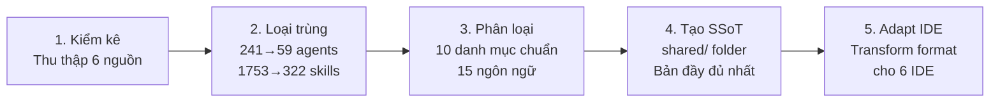
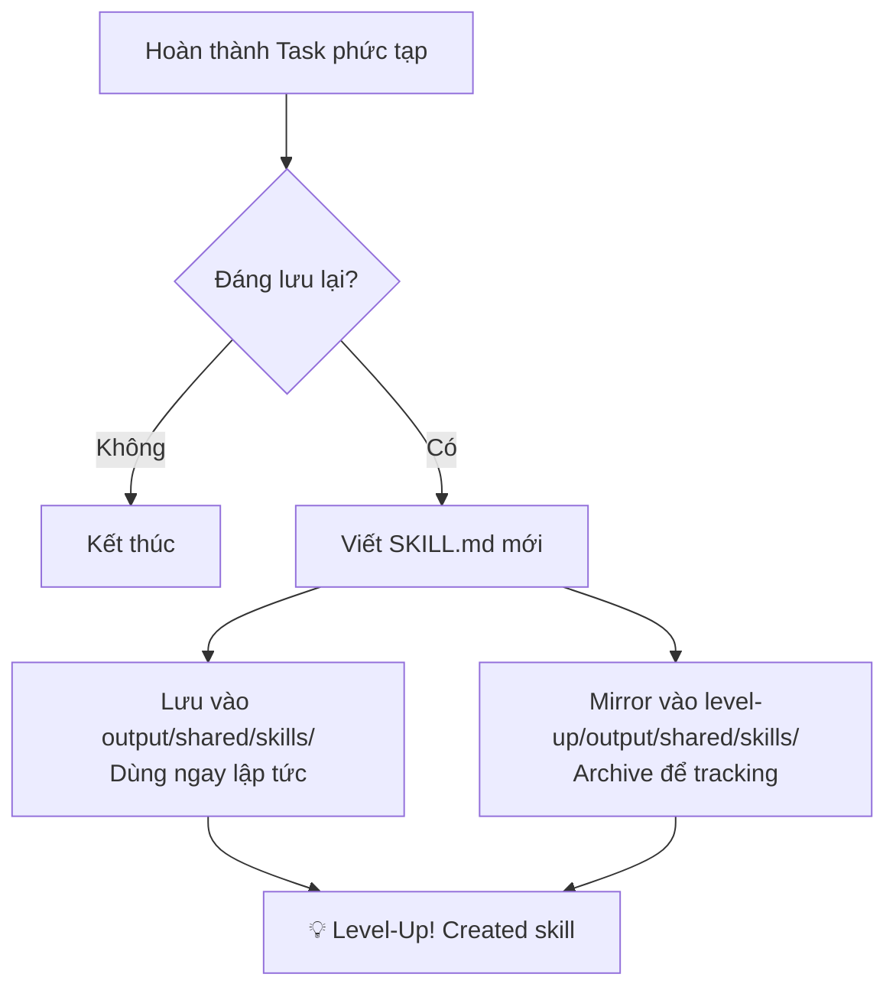

# 🧰 Unified AI Agent Toolkit v2.2

> **Giải pháp "Drop-in"** tích hợp AI Agent cho **6 IDE** phổ biến nhất.
> Copy folder tương ứng vào dự án → AI tự động hoạt động, tự học, và ngày càng thông minh hơn.

[]()
[]()
[]()
[]()
[]()

---

## 📖 Mục lục

1.  [Tổng quan](#-tổng-quan)
2.  [Nguồn gốc & Phương pháp](#-nguồn-gốc--phương-pháp)
    - [6 Toolkit gốc](#6-toolkit-đã-hợp-nhất)
    - [Phương pháp hợp nhất](#phương-pháp-hợp-nhất-5-bước)
3.  [Cấu trúc thư mục](#-cấu-trúc-thư-mục)
    - [Tổng quan cấu trúc output/](#tổng-quan-cấu-trúc)
    - [Chi tiết từng folder IDE](#chi-tiết-từng-folder-ide)
4.  [Thống kê chi tiết](#-thống-kê-chi-tiết)
    - [Tổng quát](#tổng-quát)
    - [Chi tiết theo IDE](#chi-tiết-theo-ide)
    - [Ngôn ngữ lập trình được hỗ trợ](#ngôn-ngữ-lập-trình-được-hỗ-trợ)
    - [Skills theo danh mục](#skills-theo-danh-mục-top-10)
5.  [Hướng dẫn sử dụng từng IDE](#-hướng-dẫn-sử-dụng-từng-ide)
    - [Antigravity IDE](#1-antigravity-ide--đầy-đủ-nhất)
    - [Cursor IDE](#2-cursor-ide)
    - [Visual Studio Code](#3-visual-studio-code)
    - [Kiro IDE](#4-kiro-ide)
    - [OpenCode](#5-opencode)
    - [Visual Studio](#6-visual-studio)
    - [Hermes Agent (Bonus)](#7-hermes-agent-bonus)
    - [Dùng tất cả IDE cùng lúc](#8-dùng-tất-cả-ide-cùng-lúc)
6.  [Self-Learning Protocol (Hermes-inspired)](#-self-learning-protocol-hermes-inspired)
    - [Quy trình tự học Dual-Save](#quy-trình-tự-học-dual-save)
    - [Level-Up Archive](#-level-up-archive)
    - [Trigger Conditions](#trigger-conditions)
    - [Agents liên quan](#agents-liên-quan)
7.  [Shared — Single Source of Truth](#-shared--single-source-of-truth)
    - [Mục đích](#mục-đích)
    - [Tác động với từng IDE](#tác-động-với-từng-ide)
8.  [Điểm mạnh & Hạn chế](#-điểm-mạnh--hạn-chế)
    - [Điểm mạnh](#-điểm-mạnh)
    - [Hạn chế](#-hạn-chế)
9.  [Ví dụ thực tế](#-ví-dụ-thực-tế)
    - [Orchestrate xây dựng API](#ví-dụ-1-orchestrate-xây-dựng-api-antigravitycursor)
    - [Debug lỗi C#](#ví-dụ-2-debug-lỗi-c-visual-studio)
    - [Kiro auto-steering](#ví-dụ-3-kiro-auto-steering)
    - [Self-Learning trong hành động](#ví-dụ-4-self-learning-trong-hành-động)
10. [Kế hoạch nâng cấp](#-kế-hoạch-nâng-cấp)

---

## 🎯 Tổng quan

Dự án này hợp nhất **6 bộ AI toolkit hàng đầu** thành **1 hệ thống cấu hình chuẩn hóa** cho **6 IDE**, với kiến trúc **Single Source of Truth** (SSoT).

Mọi IDE đều chia sẻ cùng kiến thức nền tảng nhưng được chuyển đổi (adapt) sang đúng format native của từng IDE.

### Tính năng nổi bật

| Tính năng | Mô tả |
|-----------|-------|
| 🤖 **59 Agents chuyên biệt** | orchestrator, backend, frontend, security, debugger, skill-curator... |
| 📚 **322 Skills** | Bao gồm 117 skills từ Hermes Agent (NousResearch) |
| 📏 **89 Rules** | Hỗ trợ **15 ngôn ngữ lập trình** |
| 🧠 **Self-Learning Protocol** | AI tự tạo skills mới từ kinh nghiệm (Hermes-inspired) |
| 🆙 **Level-Up Archive** | Tự động lưu trữ tiến hóa AI vào thư mục riêng để quản lý |
| 🔒 **OWASP Top 10** | Tích hợp sẵn trong `security-auditor` |
| 🎯 **C#/.NET first-class** | Clean Architecture, EF Core, xUnit, Minimal API |
| 📦 **Zero-Config** | Copy-Paste là hoạt động ngay lập tức |

---

## 🔬 Nguồn gốc & Phương pháp

### 6 Toolkit đã hợp nhất

| # | Toolkit | Stars | Đóng góp chính |
|---|---------|:---:|----------------|
| 1 | **antigravity-kit** | — | Agents, skills, workflows, hooks — nền tảng Antigravity |
| 2 | **everything-claude-code (ECC)** | — | 203 skills + dotnet-patterns, TDD workflow |
| 3 | **superpowers** | — | TDD, planning, subagent coordination, Git nâng cao |
| 4 | **awesome-copilot** | — | 182+ agents, 173+ instructions cho GitHub Copilot |
| 5 | **antigravity-awesome-skills** | — | 1293+ community skills |
| 6 | **hermes-agent** (NousResearch) | 66.6k | Self-learning loop, 117 skills, skill-evolution protocol |

### Phương pháp hợp nhất (5 bước)



| Bước | Input | Output | Tỷ lệ giảm |
|------|:---:|:---:|:---:|
| Kiểm kê | 6 repos | ~2000 files | — |
| Loại trùng | 241 agents | **59 agents** | -75% |
| Loại trùng | 1753 skills | **322 skills** | -82% |
| Loại trùng | 189 rules | **89 rules** | -53% |
| Phân loại | — | 10 categories, 15 langs | — |
| Tạo SSoT | — | `shared/` folder | — |
| Adapt | 1 shared | **6 IDE folders** | — |

---

## 📂 Cấu trúc thư mục

### Tổng quan cấu trúc

```
output/
│
├── shared/                    ← 🧠 Single Source of Truth (KHÔNG IDE nào đọc trực tiếp)
│   ├── agents/     (59 files) ← Tất cả agent definitions
│   ├── skills/    (322 dirs)  ← Tất cả skills (SKILL.md format)
│   ├── rules/      (89 files) ← Rules theo ngôn ngữ (15 thư mục)
│   ├── workflows/  (11 files) ← Workflow definitions
│   └── hooks/       (4 files) ← Hook scripts (typecheck, quality-gate...)
│
├── .agent/                    ← Antigravity IDE (full sync từ shared/)
├── .cursor/                   ← Cursor IDE (rules + skills)
├── .vscode/                   ← VS Code (16 agents + 31 skills)
├── .kiro/                     ← Kiro IDE (8 steering files)
├── .opencode/                 ← OpenCode (AGENTS.md + opencode.json)
├── .vs/                       ← Visual Studio (copilot-instructions.md)
│
├── level-up/                  ← 🆙 Evolution Archive (mới)
│   └── README.md              ← Hướng dẫn merge kĩ năng mới vào toolkit
│
├── docs/
│   └── MASTER_CATALOG.md      ← Kiểm kê chi tiết gốc từ 6 toolkits
│
├── GEMINI.md                  ← Root config cho Antigravity
├── .cursorrules               ← Root config cho Cursor
├── AGENTS.md                  ← Root config cho Kiro/OpenCode (15 agents)
├── hermes-config.yaml.example ← Cấu hình cho Hermes Agent
├── README.md                  ← 📄 Tài liệu này
└── PLAN_UPDATE.md             ← 📅 Lộ trình nâng cấp tương lai
```

### Chi tiết từng folder IDE

<details>
<summary><b>.agent/ — Antigravity IDE (Click để mở)</b></summary>

```
.agent/
├── agents/     (59 files)  ← orchestrator.md, backend-specialist.md...
├── skills/    (322 dirs)   ← Mỗi skill = 1 folder chứa SKILL.md
├── workflows/  (11 files)  ← brainstorm.md, create.md, debug.md...
└── hooks/       (4 files)  ← hooks.json, run-hook.cmd, session-start...
```
</details>

<details>
<summary><b>.cursor/ — Cursor IDE (Click để mở)</b></summary>

```
.cursor/
├── rules/      (89 files)  ← Phân theo ngôn ngữ (csharp/, typescript/...)
└── skills/    (322 dirs)   ← Full sync từ shared/
```
</details>

<details>
<summary><b>.vscode/ — Visual Studio Code (Click để mở)</b></summary>

```
.vscode/
├── agents/     (16 files)  ← Custom Agents cho Copilot Agent Mode
│   ├── orchestrator.md
│   ├── backend-specialist.md
│   ├── frontend-specialist.md
│   ├── database-architect.md
│   ├── security-auditor.md
│   ├── test-engineer.md
│   ├── debugger.md
│   ├── code-reviewer.md
│   ├── devops-engineer.md
│   ├── project-planner.md
│   ├── architect.md
│   ├── performance-optimizer.md
│   ├── mobile-developer.md
│   ├── documentation-writer.md
│   ├── csharp-reviewer.md
│   └── skill-curator.md
├── skills/     (31 dirs)   ← Chọn lọc skills quan trọng nhất
├── copilot-instructions.md  ← Hướng dẫn chính cho Copilot
└── settings.json            ← VS Code settings
```
</details>

<details>
<summary><b>.kiro/ — Kiro IDE (Click để mở)</b></summary>

```
.kiro/
└── steering/   (8 files)   ← Auto-loaded rules theo fileMatch
    ├── csharp-standards.md
    ├── typescript-standards.md
    ├── python-standards.md
    ├── security-rules.md
    ├── testing-rules.md
    ├── api-design.md
    ├── self-learning.md     ← 🆙 Level-Up protocol
    └── ...
```
</details>

<details>
<summary><b>.opencode/ — OpenCode (Click để mở)</b></summary>

```
.opencode/
├── opencode.json            ← 6 commands (/plan, /review, /test...)
└── AGENTS.md                ← Agent definitions + Self-Learning
```
</details>

<details>
<summary><b>.vs/ — Visual Studio (Click để mở)</b></summary>

```
.vs/
└── copilot-instructions.md  ← C#/.NET focused + Self-Learning
```
</details>

---

## 📊 Thống kê chi tiết

### Tổng quát

| Metric | Số lượng |
|--------|:---:|
| Toolkits gốc đã hợp nhất | **6** |
| Agents chuyên biệt | **59** |
| Skills (kỹ năng) | **322** |
| Rules (quy tắc) | **89** |
| Workflows | **11** |
| Hooks | **4** |
| IDE được hỗ trợ | **6** |

### Chi tiết theo IDE

| IDE | Folder | Agents | Skills | Rules/Steering | Root Config | Self-Learning |
|-----|--------|:---:|:---:|:---:|:---:|:---:|
| **Antigravity** | `.agent/` | 59 | 322 | — | `GEMINI.md` | ✅ |
| **Cursor** | `.cursor/` | — | 322 | 89 | `.cursorrules` | ✅ |
| **VS Code** | `.vscode/` | 16 | 31 | — | `copilot-instructions.md` | ✅ |
| **Kiro** | `.kiro/` | — | — | 8 | `AGENTS.md` | ✅ |
| **OpenCode** | `.opencode/` | — | — | — | `AGENTS.md` + `opencode.json` | ✅ |
| **Visual Studio** | `.vs/` | — | — | — | `copilot-instructions.md` | ✅ |

### Ngôn ngữ lập trình được hỗ trợ

| # | Ngôn ngữ | Folder trong `rules/` | Số rules |
|---|----------|:---:|:---:|
| 1 | **C#/.NET** | `csharp/` | 8 |
| 2 | **TypeScript/JavaScript** | `typescript/` | 7 |
| 3 | **Python** | `python/` | 6 |
| 4 | **Go** | `golang/` | 5 |
| 5 | **Rust** | `rust/` | 5 |
| 6 | **Java** | `java/` | 5 |
| 7 | **Kotlin** | `kotlin/` | 5 |
| 8 | **Swift** | `swift/` | 4 |
| 9 | **Dart/Flutter** | `dart/` | 4 |
| 10 | **C++** | `cpp/` | 4 |
| 11 | **PHP/Laravel** | `php/` | 4 |
| 12 | **Perl** | `perl/` | 3 |
| 13 | **Web (HTML/CSS)** | `web/` | 4 |
| 14 | **Common** | `common/` | 6 |
| 15 | **Chinese (中文)** | `zh/` | 1 |

### Skills theo danh mục (Top 10)

| Danh mục | Số lượng | Ví dụ tiêu biểu |
|----------|:---:|-------|
| Software Development | 42 | plan, tdd, debugging, code-review, clean-code |
| MLOps / AI | 35 | axolotl, vllm, pytorch, dspy, unsloth |
| DevOps | 28 | docker, deployment, CI/CD, terraform |
| Frontend | 22 | react, tailwind, frontend-design, swiftui |
| Security | 19 | OWASP, vulnerability-scanner, 1password |
| Backend | 18 | dotnet-patterns, api-design, golang, django |
| Creative | 15 | excalidraw, p5js, songwriting, meme-generation |
| Database | 12 | postgres, migrations, schema-design, clickhouse |
| Research | 11 | arxiv, deep-research, polymarket, llm-wiki |
| GitHub | 8 | pr-workflow, code-review, issues, repo-management |

---

## 🚀 Hướng dẫn sử dụng từng IDE

### 1. Antigravity IDE ⭐ (Đầy đủ nhất)

```powershell
# Copy vào project root:
Copy-Item -Path "output/.agent" -Destination "your-project/" -Recurse
Copy-Item "output/GEMINI.md" "your-project/"

# Sử dụng (trong Chat):
/orchestrate Xây dựng REST API cho hệ thống quản lý đơn hàng
/plan Lên kế hoạch refactor module Auth
/debug Phân tích tại sao API trả về 500
```

**Tính năng riêng:** 59 agents, 322 skills, 11 workflows, 4 hooks.

---

### 2. Cursor IDE

```powershell
Copy-Item -Path "output/.cursor" -Destination "your-project/" -Recurse
Copy-Item "output/.cursorrules" "your-project/"

# Cursor tự động đọc .cursorrules + rules/. Mở Chat hoặc Composer để dùng.
```

**Tính năng riêng:** 89 language-specific rules, 322 skills.

---

### 3. Visual Studio Code

```powershell
Copy-Item -Path "output/.vscode" -Destination "your-project/" -Recurse

# GitHub Copilot Agent Mode → tự nhận diện copilot-instructions.md
# Gọi agents: @orchestrator, @backend-specialist, @debugger...
```

**Tính năng riêng:** 16 Custom Agents cho Copilot Agent Mode.

---

### 4. Kiro IDE

```powershell
Copy-Item -Path "output/.kiro" -Destination "your-project/" -Recurse
Copy-Item "output/AGENTS.md" "your-project/"

# Kiro tự load steering files dựa trên fileMatch.
# Mở file .cs → csharp-standards.md tự kích hoạt.
```

**Tính năng riêng:** 8 steering files với auto-activation theo loại file.

---

### 5. OpenCode

```powershell
Copy-Item -Path "output/.opencode" -Destination "your-project/" -Recurse

# Dùng commands: /plan, /review, /test, /debug, /security, /dotnet
```

**Tính năng riêng:** 6 pre-defined commands.

---

### 6. Visual Studio

```powershell
Copy-Item -Path "output/.vs" -Destination "your-project/" -Recurse

# GitHub Copilot tự đọc copilot-instructions.md
# Tối ưu sâu cho: C#/.NET, Clean Architecture, EF Core, xUnit
```

**Tính năng riêng:** Chuyên sâu C#/.NET với đầy đủ patterns và code samples.

---

### 7. Hermes Agent (Bonus)

```powershell
# Copy template config:
Copy-Item "output/hermes-config.yaml.example" "$HOME/.hermes/config.yaml"

# Chỉnh sửa external_dirs trong config để trỏ vào shared/skills/
# → Hermes dùng ngay 322 skills mà không cần import gì thêm!
```

---

### 8. Dùng tất cả IDE cùng lúc

```powershell
# Copy toàn bộ output/ vào project:
Copy-Item -Path "output/*" -Destination "your-project/" -Recurse -Force
# Copy hidden folders:
Get-ChildItem "output" -Directory -Hidden | ForEach-Object {
    Copy-Item $_.FullName "your-project/$($_.Name)" -Recurse -Force
}
```

> **Lưu ý:** Các IDE sẽ chỉ đọc folder của mình. Việc copy tất cả không gây xung đột.

---

## 🧠 Self-Learning Protocol (Hermes-inspired)

Đây là tính năng **game-changer** — AI tự tạo skills mới từ kinh nghiệm, giúp bộ Toolkit của bạn **ngày càng thông minh hơn** theo thời gian.

### Quy trình tự học Dual-Save



1.  Sau khi hoàn thành task phức tạp (5+ bước), AI tự đánh giá "skill-worthiness".
2.  Nếu đáng lưu → Viết `SKILL.md` với YAML frontmatter + procedure + pitfalls.
3.  **Dual-Save (Lưu kép)**:
    -   Ghi vào `output/shared/skills/` → IDE dùng ngay.
    -   Ghi vào `level-up/output/shared/skills/` → Bạn tracking và merge sau.
4.  AI thông báo: `💡 Level-Up! Created skill: <name> | Archived in level-up/`

### 🆙 Level-Up Archive

Thư mục `level-up/` phản chiếu chính xác cấu trúc của bộ Toolkit. Khi bạn muốn merge vĩnh viễn:

```powershell
# Merge toàn bộ kiến thức mới vào toolkit gốc:
Copy-Item -Path "level-up/*" -Destination "." -Recurse -Force
```

| Vai trò | Giải thích |
|---------|-----------|
| **Tracking** | Biết AI đã học được gì mới hôm nay |
| **Review** | Xem lại chất lượng skills trước khi merge |
| **Portable** | Copy `level-up/` sang dự án khác để chia sẻ kiến thức |

### Trigger Conditions

| Điều kiện | Mô tả |
|-----------|-------|
| ✅ Task phức tạp thành công | 5+ bước hoặc đa file |
| ✅ Error recovery | Tìm được đường đi đúng sau khi bị lỗi |
| ✅ User correction | Người dùng sửa lại approach của AI |
| ✅ Non-trivial workflow | Phát hiện quy trình không rõ ràng |

### Agents liên quan

| Agent | Vai trò |
|-------|---------|
| **`skill-curator`** | Meta-agent quản lý vòng đời skill |
| **`self-learning-loop`** | Protocol kỹ thuật tạo skill mới |
| **`skill-evolution`** | Protocol cải thiện skill có sẵn |

---

## 📦 Shared — Single Source of Truth

### Mục đích

`shared/` là **"kho nguyên liệu gốc"** — chứa bản đầy đủ nhất đã loại trùng từ 6 toolkits. Nó **KHÔNG trực tiếp được IDE nào đọc** (trừ Hermes via `external_dirs`).

```
shared/
├── agents/     (59)   ← Nguồn gốc của .agent/agents/, .vscode/agents/...
├── skills/    (322)   ← Nguồn gốc của .agent/skills/, .cursor/skills/...
├── rules/      (89)   ← Nguồn gốc của .cursor/rules/, .kiro/steering/...
├── workflows/  (11)   ← Nguồn gốc của .agent/workflows/
└── hooks/       (4)   ← Nguồn gốc của .agent/hooks/
```

### Tác động với từng IDE

| IDE | Lấy gì từ shared/? | Cách chuyển đổi | Đọc trực tiếp? |
|-----|---------------------|-----------------|:---:|
| **Antigravity** | agents/ + skills/ + workflows/ + hooks/ | Copy nguyên | ❌ |
| **Cursor** | rules/ + skills/ | Copy nguyên | ❌ |
| **VS Code** | 16 agents + 31 skills (chọn lọc) | Copy chọn lọc | ❌ |
| **Kiro** | rules/ | Transform → 8 steering files | ❌ |
| **OpenCode** | agents/ | Tóm tắt → AGENTS.md | ❌ |
| **Visual Studio** | rules/csharp/ | Tóm tắt → copilot-instructions.md | ❌ |
| **Hermes** | skills/ | Đọc qua `external_dirs` config | ✅ |

### Quy trình cập nhật

```
Sửa trong shared/ → Chạy sync → 6 IDE folders tự cập nhật
                     (hiện tại manual, v2.3 sẽ có script tự động)
```

---

## 💪 Điểm mạnh & Hạn chế

### 🌟 Điểm mạnh

| # | Điểm mạnh | Chi tiết |
|---|-----------|----------|
| 1 | **Hợp nhất 6 toolkit** | Tinh hoa từ 6 nguồn + 66.6k star Hermes Agent |
| 2 | **Self-Learning** | AI tự cải thiện theo thời gian — unique feature |
| 3 | **Level-Up Archive** | Theo dõi tiến hóa AI, merge bằng 1 lệnh copy |
| 4 | **Orchestrator-First** | Quy trình Plan → Execute → Verify nhất quán |
| 5 | **C#/.NET first-class** | dotnet-patterns, csharp-testing, EF Core, Clean Architecture |
| 6 | **15 ngôn ngữ** | C#, TS, Python, Go, Rust, Java, Kotlin, Swift, Dart, C++, PHP, Perl... |
| 7 | **Zero-Config** | Copy-Paste là hoạt động ngay — không cần cài đặt gì thêm |
| 8 | **IDE-native** | Tận dụng tính năng riêng từng IDE (Kiro fileMatch, VS Code Custom Agents) |
| 9 | **Hermes compatible** | Skills portable theo chuẩn agentskills.io |
| 10 | **Open Source** | MIT License — tự do sử dụng và sửa đổi |

### ⚠️ Hạn chế

| # | Hạn chế | Giải pháp tương lai |
|---|---------|---------------------|
| 1 | **Dung lượng lớn** (~5MB) | Slim Mode ở v2.3 (~30 skills cốt lõi) |
| 2 | **Context window** | Cần LLM context ≥128k cho multi-agent |
| 3 | **Chưa auto-sync** | Script tự động ở v2.3 |
| 4 | **IDE giới hạn** | VS, OpenCode chỉ qua instruction files |
| 5 | **Manual merge** | Level-Up Merger script ở v2.3 |

---

## 💡 Ví dụ thực tế

### Ví dụ 1: Orchestrate xây dựng API (Antigravity/Cursor)

```
📝 User: /orchestrate Xây dựng REST API cho hệ thống quản lý đơn hàng

🤖 AI Workflow:
1. 📋 orchestrator    → Nhận và phân tích yêu cầu
2. 📝 project-planner → Tạo PLAN.md chi tiết
3. 🏗️ architect       → Chọn Clean Architecture + Minimal API
4. 💾 database-architect → Thiết kế schema: Orders, OrderItems, Customers
5. ⚙️ backend-specialist → Viết API endpoints + EF Core DbContext
6. 🔒 security-auditor → Quét OWASP vulnerabilities, kiểm tra auth
7. 🧪 test-engineer   → Viết xUnit tests + integration tests
8. 💡 skill-curator   → Tạo skill mới "order-api-pattern"
                         → Lưu vào output/shared/ VÀ level-up/
```

### Ví dụ 2: Debug lỗi C# (Visual Studio)

```
📝 User: Tại sao API trả về 500 khi gọi /api/orders?

🤖 AI (đọc copilot-instructions.md):
1. 🔍 debugger        → 4-phase systematic debugging
2. 🔎 Phát hiện:      → Thiếu CancellationToken, dùng async void
3. 🔧 Fix applied:    → Thêm CancellationToken, đổi async Task
4. 💡 skill-curator   → Tạo skill "aspnet-common-pitfalls"
                         → Lưu vào level-up/ để tracking
```

### Ví dụ 3: Kiro auto-steering

```
📝 Khi mở file OrderService.cs:

🤖 Kiro tự động:
1. Load csharp-standards.md steering   (fileMatch: "*.cs")
2. AI biết dùng sealed class, record DTO, CancellationToken
3. Khi task hoàn thành → self-learning.md trigger tạo skill mới
4. Skill mới xuất hiện trong level-up/ folder
```

### Ví dụ 4: Self-Learning trong hành động

```
📝 Phiên làm việc phức tạp (8 bước):

🤖 AI hoàn thành → skill-curator kích hoạt:
1. Đánh giá: "Quy trình tích hợp Stripe Payment là reusable? → CÓ"
2. Viết: level-up/output/shared/skills/stripe-integration/SKILL.md
3. Thông báo: 💡 Level-Up! Created skill: stripe-integration
4. Ngày mai, khi dự án khác cần Stripe → AI đã biết cách làm!
```

---

## 📅 Kế hoạch nâng cấp

Chi tiết tại [PLAN_UPDATE.md](PLAN_UPDATE.md).

| Version | Timeline | Key Feature |
|---------|----------|-------------|
| **v2.2** ✅ | Hiện tại | Hermes integration, Self-Learning, Level-Up Archive, 322 skills |
| **v2.3** | 1-2 tháng | Auto-sync script, Level-Up Merger, Slim Mode |
| **v3.0** | 3-6 tháng | MCP Server, Template Generator (`npx create-unified-toolkit`) |
| **v4.0** | 6-12 tháng | Self-Learning v2, Community Marketplace, Cloud Sync |

---

## 📄 License

MIT — Free to use, modify, and distribute.

---

<p align="center">
  <b>Unified AI Agent Toolkit v2.2</b><br/>
  <i>Powered by: antigravity-kit + ECC + superpowers + awesome-copilot + antigravity-awesome-skills + hermes-agent</i><br/>
  <i>Built with ❤️ by Antigravity AI — 2026</i>
</p>
