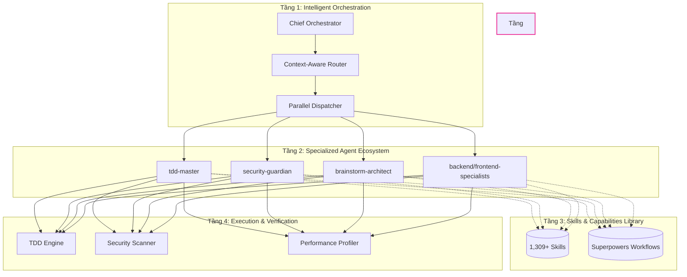

# 🧰 AI Agent Toolkit v2.4

> **Giải pháp "Drop-in"** tích hợp AI Agent cấp doanh nghiệp cho **6 IDE** phổ biến nhất.
> Mang đến kiến trúc đa tầng, bộ nhớ đồ thị (Graph Memory), và khả năng tự học (Self-Learning) để biến mọi IDE thành môi trường phát triển siêu việt.

[]()
[]()
[]()
[]()
[]()

---

## 📖 Mục lục

1. [Tại sao chọn AI Agent Toolkit?](#-tại-sao-chọn-ai-agent-toolkit)
2. [Kiến trúc Hệ thống (System Architecture)](#-kiến-trúc-hệ-thống-4-tầng)
3. [Cơ chế Đột phá (Breakthrough Mechanics)](#-cơ-chế-đột-phá)
4. [Cấu trúc Repository (Project Structure)](#-cấu-trúc-repository)
5. [Hướng dẫn Tích hợp (Quick Start)](#-hướng-dẫn-tích-hợp-zero-config)
6. [Quy trình Hoạt động Cốt lõi (Core Workflows)](#-quy-trình-hoạt-động-cốt-lõi)
7. [Lộ trình Nâng cấp (Upgrade Roadmap)](#-lộ-trình-nâng-cấp-roadmap)

---

## 🎯 Tại sao chọn AI Agent Toolkit?

Dành cho các Developer và Technical Lead đòi hỏi sự khắt khe về chất lượng mã nguồn và tự động hóa:

- **Single Source of Truth (SSoT)**: Một bộ não duy nhất, đồng bộ hóa hoàn hảo cho 6 IDE (Antigravity, Cursor, VS Code, Kiro, OpenCode, Visual Studio).
- **Quy mô Doanh nghiệp**: Tích hợp hơn 30+ Agent chuyên biệt và 1,309+ Skills (Architecture, Security, DevOps, Testing, v.v.).
- **Chất lượng Mã nguồn (Quality Gates)**: Ép buộc (enforce) Test-Driven Development (TDD) chuẩn mực (RED-GREEN-REFACTOR) và tự động quét bảo mật OWASP Top 10.
- **Tiến hóa Liên tục**: AI không chỉ code, mà còn học hỏi từ dự án của bạn và lưu trữ kinh nghiệm thành tài sản lâu dài.

---

## 🏛️ Kiến trúc Hệ thống (4 Tầng)

Hệ thống được thiết kế theo chuẩn module, tách biệt giữa điều phối, thực thi, kiến thức và kiểm định.


```mermaid
graph TD
    subgraph Tầng 1: Intelligent Orchestration
        O[Chief Orchestrator] --> R[Context-Aware Router]
        R --> D[Parallel Dispatcher]
    end

    subgraph Tầng 2: Specialized Agent Ecosystem
        D --> A1[tdd-master]
        D --> A2[security-guardian]
        D --> A3[brainstorm-architect]
        D --> A4[backend/frontend-specialists]
    end

    subgraph Tầng 3: Skills & Capabilities Library
        A1 & A2 & A3 & A4 -.-> S1[(1,309+ Skills)]
        A1 & A2 & A3 & A4 -.-> S2[(Superpowers Workflows)]
    end

    subgraph Tầng 4: Execution & Verification
        A1 & A2 & A3 & A4 --> E1[TDD Engine]
        A1 & A2 & A3 & A4 --> E2[Security Scanner]
        A1 & A2 & A3 & A4 --> E3[Performance Profiler]
    end

    style Tầng 1 fill:#f9f9f9,stroke:#333,stroke-width:2px
    style Tầng 2 fill:#e6f7ff,stroke:#1890ff,stroke-width:2px
    style Tầng 3 fill:#f6ffed,stroke:#52c41a,stroke-width:2px
    style Tầng 4 fill:#fff0f6,stroke:#eb2f96,stroke-width:2px
```

1. **Intelligent Orchestration**: Điều phối meta-agent, quyết định việc chạy song song (parallel dispatch) hay tuần tự (sequential) dựa trên task.
2. **Specialized Agent Ecosystem**: 30+ agents đóng vai trò chuyên gia cho từng domain (Security, Database, Frontend, Backend, DevOps).
3. **Skills Library**: Kho tàng 1,309+ skills bao phủ toàn diện từ Architecture, Testing đến Cloud Infrastructure.
4. **Execution & Verification**: Các chốt chặn (gates) bắt buộc phải vượt qua trước khi hoàn thành task (Lint, OWASP, E2E).

---

## 🚀 Cơ chế Đột phá

### 1. Self-Learning Protocol (Giao thức Tự học)
AI tự động đúc kết kinh nghiệm sau mỗi task phức tạp (>5 bước), error recovery hoặc từ những lần bạn "nắn" (correct) nó. 
- Viết thành file `SKILL.md`.
- **Dual-Save**: Lưu trực tiếp vào toolkit để dùng ngay, và mirror (phản chiếu) vào thư mục `level-up/` để Technical Lead review và theo dõi lịch sử tiến hóa.

### 2. Graph Memory (Mem0 v2.3 Integration)
Vượt qua rào cản giới hạn Context Window. AI Agent Toolkit v2.4 được tích hợp Knowledge Graph ngoài (thông qua MCP - Model Context Protocol).
- Nhớ được các Quyết định Kiến trúc (ADR).
- Hiểu được Mối quan hệ: `File A` --DEPENDS_ON--> `Component B`.
- Giữ được Sở thích cá nhân của Developer xuyên suốt nhiều phiên làm việc.

### 3. Strict TDD & Security-First
Mọi đoạn code sinh ra đều phải tuân thủ luồng:
`BRAINSTORM → PLAN → RED (Failing Test) → GREEN (Impl) → REFACTOR → SECURITY SCAN (OWASP) → DONE`.

---

## 📂 Cấu trúc Repository

Mô hình **Single Source of Truth (SSoT)** được áp dụng tuyệt đối. Bạn chỉ sửa ở `shared/`, hệ thống sẽ làm phần còn lại.

```
output/
│
├── shared/                    ← 🧠 Single Source of Truth (Chỉnh sửa tại đây)
│   ├── agents/     (30+)      ← Agent definitions (tdd-master, security-guardian...)
│   ├── skills/     (1309+)    ← Tất cả skills định dạng SKILL.md
│   └── rules/                 ← Các rule về Coding Convention
│
├── .agent/                    ← Dành cho Antigravity IDE (Full Sync)
├── .cursor/                   ← Dành cho Cursor IDE
├── .github/                   ← Dành cho VS Code / Copilot
├── .kiro/                     ← Dành cho Kiro IDE
├── .opencode/                 ← Dành cho OpenCode
├── .vs/                       ← Dành cho Visual Studio
│
├── scripts/                   
│   └── sync_all.ps1           ← ⚙️ Sync Engine: Đồng bộ từ shared/ ra 6 thư mục IDE
│
└── level-up/                  ← 🆙 Evolution Archive (Nơi lưu các Skill AI tự học được)
```

---

## ⚡ Hướng dẫn Tích hợp (Zero-Config)

AI Agent Toolkit được thiết kế theo nguyên lý "Drop-in". Không cài đặt rườm rà.

### Bước 1: Copy vào dự án
Copy thư mục tương ứng với IDE của bạn vào thư mục gốc của dự án.

| IDE | Thư mục cần copy | Lệnh kích hoạt |
|-----|------------------|----------------|
| **Antigravity** | `.agent/` & `GEMINI.md` | `/orchestrate`, `/plan`, `/debug` |
| **Cursor** | `.cursor/` & `.cursorrules` | Tự động qua Chat/Composer |
| **VS Code** | `.github/` | Gọi @orchestrator, @tdd-master |
| **Kiro IDE** | `.kiro/` & `AGENTS.md` | Tự động load steering files |
| **OpenCode** | `.opencode/` | Dùng các commands cấu hình sẵn |
| **Visual Studio** | `.vs/` | Tối ưu chuyên sâu cho C#/.NET |

### Bước 2: Đồng bộ kiến thức (Khi có cập nhật)
Nếu bạn thay đổi file trong `shared/`, chỉ cần chạy Sync Engine:
```powershell
./scripts/sync_all.ps1
```

---

## 🔄 Quy trình Hoạt động Cốt lõi

Thay vì bắt AI "viết code ngay", bộ toolkit sử dụng workflow chuyên nghiệp của các kỹ sư phần mềm:

1. **Socratic Brainstorming**: Phân tích yêu cầu, phản biện và đưa ra 2-3 giải pháp kiến trúc (thực hiện bởi `brainstorm-architect`).
2. **Subagent-Driven Development**: `project-planner` chia nhỏ task, `chief-orchestrator` phân phát (dispatch) task cho các chuyên gia (Backend, Frontend, Database) chạy song song.
3. **Systematic Debugging**: Không sửa mò. `debugger` tuân thủ 4 bước: Tái hiện (Reproduce) → Cô lập (Isolate) → Truy vết gốc (Root Cause) → Sửa & Xác minh (Fix & Verify).

---

## 🔮 Lộ trình Nâng cấp (Roadmap)

Kế hoạch biến bộ toolkit thành một Hệ điều hành Agent (Agent OS) hoàn chỉnh.

### 🟢 Hiện tại: v2.4 (Horizon Integration)
- Cập nhật Supervisor Agent (VoltAgent) quản lý luồng công việc.
- Hoàn thiện tài liệu kiến trúc (DESIGN.md).
- Parity (cân bằng tính năng) trên tất cả 6 IDE.

### 🟡 Ngắn hạn: v3.0 — "Autonomous Agent OS" (3 - 6 tháng)
- **MCP Ecosystem**: Mở rộng các Model Context Protocol Server (cho phép Agent chạy Terminal, truy cập DB nội bộ, Jira, Slack).
- **Multi-project Graph**: Chia sẻ Knowledge Graph giữa nhiều repositories trong cùng tổ chức.
- **Enterprise Features**: Hỗ trợ Single Sign-On (SSO) và Role-Based Access Control (RBAC) cho môi trường doanh nghiệp.

### 🔴 Dài hạn: v4.0 — "Self-Evolving Ecosystem" (6 - 12 tháng)
- **Agent Marketplace**: Trợ lý có khả năng tự động tìm kiếm, download và áp dụng skill từ cộng đồng khi gặp công nghệ lạ.
- **Federated Memory**: Các team phát triển có thể chia sẻ Memory Graph P2P mà không cần máy chủ tập trung.
- **Memory-driven Code Review**: AI tự động review PR dựa trên toàn bộ lịch sử các quyết định kiến trúc đã lưu trong quá khứ.

---

<p align="center">
  <b>AI Agent Toolkit v2.4</b><br/>
  <i>Công cụ không thể thiếu cho Developer hiện đại.</i><br/>
  <i>Built with ❤️ by Xuan Thai & Antigravity AI</i>
</p>
